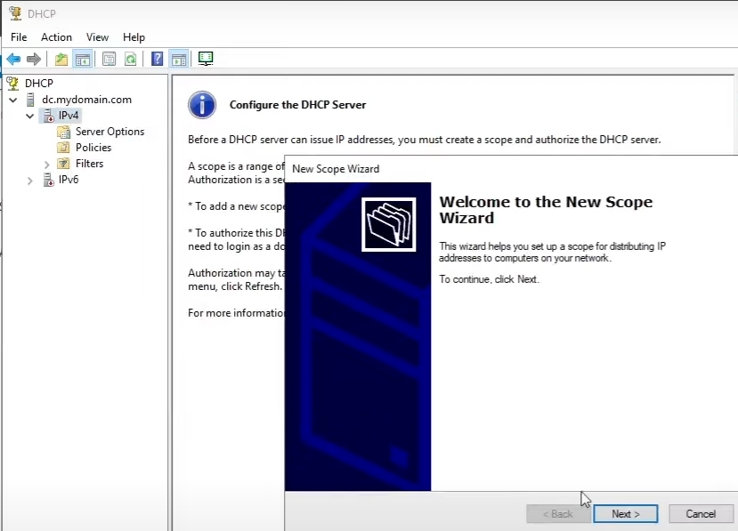

# Active Directory Lab - Step by Step Guide

## Introduction
This guide will walk you through setting up an Active Directory (AD) lab using Oracle VirtualBox, Windows Server 2019, and Windows 10. The lab will include a Domain Controller (DC), a Windows 10 client machine, and a configured network with DHCP, NAT, and Remote Access Service (RAS).

## Step 1 - Preparation

### Download Required Software:
- [Oracle VirtualBox](https://www.virtualbox.org/) - Download here
- [VirtualBox Extension Pack](https://www.virtualbox.org/wiki/Downloads) - Download here
- [Windows 10 ISO](https://www.microsoft.com/en-us/software-download/windows10) - Download here
- [Windows Server 2019 ISO](https://www.microsoft.com/en-us/evalcenter/evaluate-windows-server-2019) - Download here

### Overview:
Windows Server 2019 will function as the Domain Controller (DC) with Active Directory (AD) installed. It will have two network interfaces:
- One for Internet access
- One for internal network communication

## Step 2 - Create Virtual Machine (Domain Controller)

1. Open VirtualBox > Click **New**.
2. Set the following:
   - **Name**: DC
   - **Version**: Other Windows (64-bit)
   - **RAM**: 2048MB
   - **Processors**: 1 or 2
   - **Hard Disk**: Create a virtual hard disk now > 20GB (25+ GB recommended)
3. Click **Finish**.

### Configure Virtual Machine Settings:
- Go to **Settings > General > Advanced**:
  - **Shared Clipboard**: Bidirectional
  - **Drag and Drop**: Bidirectional
- Go to **Settings > Network**:
  - **Adapter 1**: NAT (default for internet access)
  - **Adapter 2**: Internal Network
4. Click **OK**.

### Install Windows Server 2019:
1. Start the VM, select the **Windows Server 2019 ISO**, and install.
2. Select **Windows Server 2019 (Desktop Experience)**.
3. Choose **Custom: Install Windows Only (Advanced)**.
4. Wait for the installation to complete.
5. Set an **Administrator password**.

## Step 3 - Configure Domain Controller (DC)

### Install VirtualBox Guest Additions (For better performance):
1. **Devices > Insert Guest Additions CD Image**.
2. Open **This PC > CD Drive (D:) > VBoxWindowsAdditions-amd64**.
3. Run the installer and restart the system.

### Network Configuration:
1. Rename Network Adapters:
   - Open **Network Connections (ncpa.cpl)**.
   - Identify the internal adapter (APIPA 169.254.x.x address).
   - Rename it to **_INTERNAL_**.
   - Rename the internet-facing adapter to **_INTERNET_**.
2. Assign Static IP (Internal Network Adapter):
   - **IP Address**: 172.16.0.1
   - **Subnet Mask**: 255.255.255.0
   - **Gateway**: (leave blank)
   - **DNS**: 127.0.0.1
3. Rename the Server:
   - **Settings > System > Rename this PC > DC** > Restart.

## Step 4 - Install and Configure Active Directory (AD DS)

1. Open **Server Manager** > **Add roles and features**.
2. Select **Active Directory Domain Services (AD DS)** > **Add Features**.
3. Complete installation and click **Promote this server to a domain controller**.
4. Create a **New Forest**:
   - **Root Domain Name**: mydomain.com
   - Set **DSRM Password**: Password1
   - Click **Install** and restart.
5. Login using:
   - **User**: MYDOMAIN\Administrator
   - **Password**: Password1

## Step 5 - Setup DHCP Server on DC

This will allow the client to automatically receive an IP address from the Domain Controller (DC) to connect to the network and access the internet.

### Install the DHCP Role:
1. Open **Server Manager**.
2. Go to **Manage > Add Roles and Features**.
3. Click **Next** until you reach **Server Roles**.
4. Select **DHCP Server** > Click **Add Features** when prompted.
5. Click **Next > Next > Install**.
6. Wait for the installation to complete, then click **Close**.

### Configure DHCP Server:

1. In **Server Manager**, click the **Notification Bell** (top-right) > **Complete DHCP Configuration**.
2. Click **Next > Use AD Credentials** > **Commit** > **Close**.

### Create a New Scope:
1. Open **Server Manager** > Go to **Tools > DHCP**.
2. Expand **dc.mydomain.com** > Right-click **IPv4** > **New Scope** > **Next**.
   - **Scope Name**: 172.16.0.100-200
   - **Start IP Address**: 172.16.0.100
   - **End IP Address**: 172.16.0.200
   - **Subnet Mask**: 255.255.255.0 (Length: 24)
   - Click **Next**.
3. **Router (Default Gateway)**:
   - **IP Address**: 172.16.0.1
   - Click **Add** > **Next**.
4. **DNS Settings**: Ensure 172.16.0.1 is listed as the DNS Server > **Next**.
5. **Activate Scope**: Select **Yes, activate now** > **Next > Finish**.

### Authorize DHCP Server:
1. In **DHCP Console**, right-click **dc.mydomain.com** > **Authorize**.
2. Right-click again > **Refresh**.
3. Expand **IPv4** > Confirm the scope is **Active**.
   - DHCP is now set up, and clients can receive IPs automatically.

## Step 6 - Install & Configure NAT for Internet Access

1. Open **Server Manager > Add Roles and Features**.
2. Select **Remote Access > Routing** > **Install**.
3. Open **Routing and Remote Access** (Tools > Routing).
4. Right-click **DC (local)** > **Configure & Enable**.
5. Select **Remote Access** > **Next**.
6. Select **INTERNET interface** > **Finish**.

## Step 7 - Create an Admin Account in AD

1. Open **Active Directory Users and Computers**.
2. Create a **New User**:
   - **Name**: AdminUser
   - **Username**: AdminUser
   - **Password**: Password1 (Change later!)
   - Set **Password never expires**.
3. Add to **Administrators Group**:
   - Right-click **User** > **Properties** > **Member Of** > **Add**.
   - Enter **Administrators** > **Apply**.

## Step 8 - Configure Windows 10 Client

### Create the VM:
1. Open **VirtualBox > Click New**.
2. Set the following:
   - **Name**: Client
   - **RAM**: 2048MB
   - **Network**: Internal Network
   - Enable **Drag & Drop** and **Shared Clipboard** (Bidirectional).

### Install Windows 10:
1. Attach **Windows 10 ISO** and start the VM.
2. Select **Windows 10 Pro** (Home edition cannot join a domain).
3. Follow installation prompts, but choose:
   - **Skip internet setup** (use "Limited setup").
   - **Username**: User (No password).
4. Open **CMD** (Win + R > **cmd**) and run:
   - **ipconfig**.
   - If no default gateway, check **DHCP** config on DC.
   - Ping **8.8.8.8** to test internet.

### Join Domain:
1. Right-click **Start** > **System** > **Rename this PC** (Advanced settings).
2. Change Settings > **Computer Name** > Domain: mydomain.com.
3. Enter **AdminUser** credentials: MYDOMAIN\AdminUser.
4. Restart & Login with **Domain Account**.

## Step 9 - Troubleshooting

### Common Issues:
- **No Default Gateway?** Ensure DHCP is assigning 172.16.0.1 in **Server Manager > DHCP**.
- **Client Cannot Join Domain?** Check DC’s firewall settings and IP configuration.
- **No Internet on Internal Network?** Ensure **NAT & Routing** are correctly set up in **Routing and Remote Access**.
- **Cannot Ping 8.8.8.8?** Check **Windows Firewall & NAT Rules**.

## Conclusion
This lab provides a fully functional Active Directory environment, allowing you to practice user management, group policies, and networking in a controlled virtualized setup.

## Credits
Guide By **Nicolas Cordischi**

This lab was inspired by Josh Madakor’s Active Directory series. You can check out his tutorials here:
[Josh Madakor - Active Directory Lab](https://www.youtube.com/watch?v=MHsI8hJmggI&list=PLqBeiU46hx1H--SNfTrohTOWeqkK-M2Y0&ab_channel=JoshMadakor)

Big thanks to Josh for his detailed walkthroughs!
